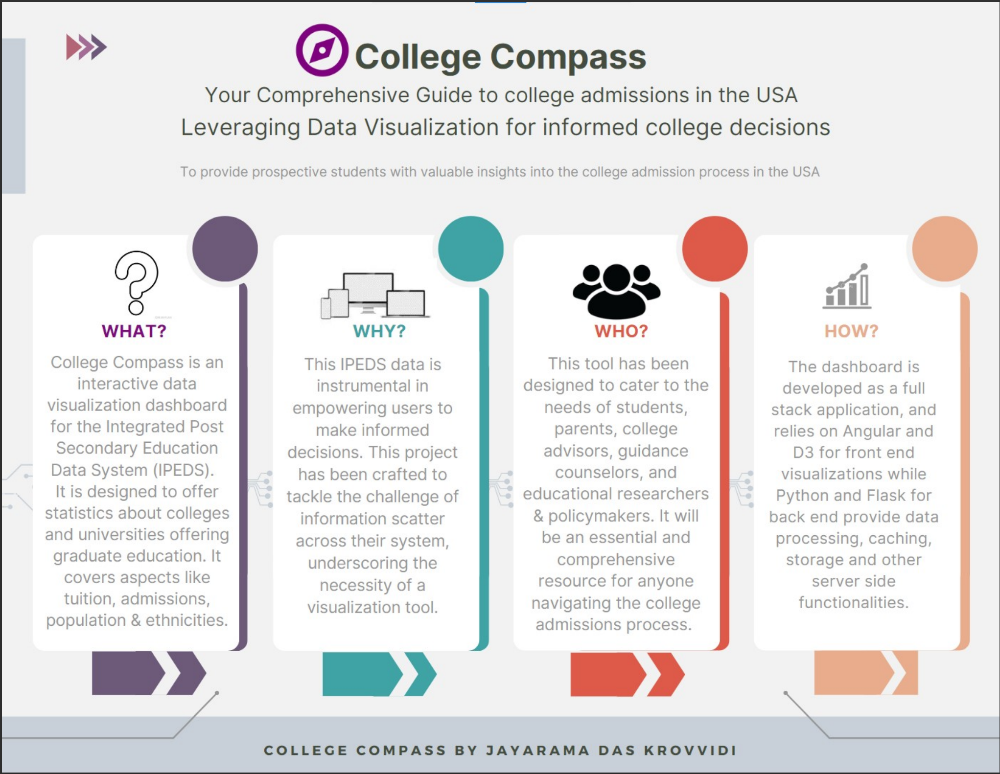

# College Compass

## Introduction
College Compass is a data visualization project that aims to provide users with insights into higher education statistics in the United States. With data provided by the National Center for Education Statistics (NCES) and their Integrated Post-secondary Education Data System (IPEDS)'s yearly release, College Compass provides visualizations and interactive tools for users to explore trends and patterns in geographical distribution, enrollment rates, tuition expenses, gender, race and ethnicity demographics, and more.

## Problem Statement
Higher education is becoming increasingly important in today's job market, but navigating the complexities of college enrollment and completion can be challenging for students, parents, and educators alike. College Compass seeks to provide a user-friendly and informative tool for exploring higher education data in order to inform decision-making and support student success.

## Design Decisions
The College Compass project utilizes the following technologies:
- Technologies Used:
    - Frontend: Angular framework for building a responsive and interactive user interface.
    - Backend: Flask framework for handling server-side logic and API endpoints.
    - Database: PostgreSQL for storing and managing college data.
    - Data Processing: Python libraries such as pandas, NumPy, and scikit-learn for data - manipulation and analysis.
    - Data Visualization: D3.js library for creating interactive and visually appealing charts and graphs.

- Data Sources:
    - The application utilized IPEDS data from https://nces.ed.gov/ipeds and downloaded more than 150 columns of admission and other statistical data for over 6000 colleges in the USA offering both undergraduate and graduate courses.
    - These sources provide comprehensive information about colleges, including admission statistics, program offerings, campus facilities, and more. The collected data per academic year is then processed, and stored in a structured format for efficient retrieval and analysis.

- User Interface:
    - The user interface of College Compass is designed to be intuitive, responsive, and visually appealing.
    - It provides filtering options across components, and interactive visualizations on the dashboard.
    - The interface focuses on presenting relevant information concisely and guiding users through the college exploration process.

- Data Visualization:
    - Data visualization plays a crucial role in College Compass, allowing users to comprehend complex information easily.
    - The application incorporates various visualization techniques, including line charts, geographic distribution, multi-level pie chart, parallel coordinate plot, and stacked bar charts.

## Resources
The College Compass project utilizes a range of tools and technologies to process and visualize the IPEDS data. The front-end of the project is built using the  The back-end is built using Flask, a Python-based web framework, with a PostgreSQL database for storing and querying the IPEDS data.

## Development Steps
The College Compass project was developed in a series of stages, with each stage building on the previous one to create a comprehensive and interactive data visualization tool. The key steps in the development process are outlined below:

| Stage | Description |
|-------|-------------|
| 1     | Data preprocessing: downloading the IPEDS dataset and cleaning and transforming the data to make it usable for analysis and visualization |
| 2     | Back-end development: building Flask APIs to serve the NCES data to the front-end |
| 3     | Front-end development: creating an Angular app with interactive visualizations and user-friendly tools for exploring the IPEDS data |
| 4     | Testing and deployment: testing the app for usability and functionality and deploying the app to a live server for public access |

## How to Use
To use College Compass, simply navigate to the live website and explore the various visualizations and interactive tools available. Users can filter and sort data by a range of variables, such as state, institution type, and demographics, to explore trends and patterns in higher education statistics.

Here is a tutorial on how to explore and play around with the dashboard:

## Use Cases
1. Student Research and Decision-making
    - Students can use College Compass to research and explore colleges based on their preferences and academic goals.
    - They can compare colleges based on admission rates, program offerings, location, campus facilities, and other relevant factors.
    - The application provides insights into admission requirements and other statistics to help students make informed decisions.

2. College Comparison and Selection
    - College Compass allows users to compare multiple colleges side by side, highlighting key differences and similarities.
    - Users can assess various factors such as financial aid options, student-faculty ratio, diversity, and graduation rates to make well-informed choices.
    - The application provides visualizations and data-driven insights to aid users in evaluating colleges based on their individual priorities.

3. Educational Planning and Counseling
    - Educators and college counselors can leverage College Compass to guide students in their educational planning journey.
    - They can use the application to recommend colleges based on students' interests, academic performance, and career aspirations.
    - The visualizations and data available in College Compass can facilitate discussions on college options, 

## Future Scope
1. Enhanced Data Insights and Recommendations:
    - Further analysis can be performed to generate personalized recommendations for users based on their preferences and goals.
    - Advanced analytics techniques, such as natural language processing and sentiment analysis, can be incorporated to analyze college reviews and provide qualitative insights.

2. Integration with External APIs
    - Integration with external APIs, such as Google Maps, can enhance the application by providing additional information about college locations, nearby amenities, and transportation options.

3. Mobile Application Development
    - Expanding College Compass to a mobile application can increase accessibility and cater to a broader user base.
    - The mobile app can leverage native device features, such as push notifications and location-based services, to offer a personalized experience.

4. Collaboration Features
    - Adding collaboration features, such as shared lists and discussion forums, can facilitate group decision-making and encourage interaction among users.

5. Personalized User Profiles
    - Implementing personalized user profiles can allow users to save their preferences, bookmark colleges, and track their college exploration progress.
    - User profiles can also enable personalized recommendations and notifications based on individual interests.

## Conclusion
College Compass is an important tool for anyone interested in higher education statistics, whether as a student, educator, or policy maker. By providing accessible and informative data visualizations, College Compass helps users make informed decisions about college enrollment and completion, and supports efforts to improve educational outcomes for all.

## Contribution Guidelines:
We welcome contributions to College Compass. To contribute, follow these guidelines:
1. Fork the project repository and create a new branch for your feature or bug fix.
2. Implement your changes and ensure they adhere to the project's coding conventions and standards.
3. Write tests to validate your changes and ensure existing functionality remains unaffected.
4. Submit a pull request detailing the changes made and providing a clear description of the contribution.

13. Contact Information:
For any inquiries or support related to College Compass, please reach out to Jayarama Das Krovvidi at jayaram.krovvidi@outlook.com.

Thank you for your interest in College Compass. We hope this comprehensive README provides a detailed understanding of the project and its potential applications.